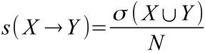
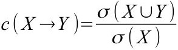

# Apriori 算法

## 项（item）

一个基本的元素，称作一个项。例如，由所有小写字母作为元素组成集合 I：

    I={a,b,c,d,e,f,g,h,i,j,k,l,m,n,o,p,q,r,s,t,u,v,w,x,y,z}

其中任意的一个小写字母，如 a，c，f 等都是集合 I 中的一个项。

## 项集（itemset）

含有 0 个或多个项的集合称作项集。例如下面的几行，每一行都是一个项集：

    {a,c,k}
    {o,p,q,t,y}
    {h,k}
    {}
    {y,z}

项集可以包含 0 个项。如果一个项集包含了 k 个项，那么称这个项集为 k-项集。例如 `{a,k,v}` 就是一个 3-项集。

项集中的项是唯一的，不考虑顺序关系，不同项集中的项可以重复。为了方便，在书写的时候，项一般是按顺序写的。

## 关联规则（Association Rule）

不同项集之间可以用箭头联系起来，表示一个项集可以根据某些关系推导到另一个项集上。表示方法示例：

    X → Y

箭头代表的关系称作关联规则。其中项集 X 和 Y 彼此间不存在任何相同的项，也就是

    X ∩ Y = Φ

关联规则的强度用两个量来表示，这两个量称作支持度和置信度。

## 支持度（support）

假设存在多个不同的项集，`I[1]，I[2]，I[3]...I[N]`，组成一个关于项集的集合`T`。小写`s`代表支持度，则`X → Y`的支持度计算方法是：

等号左边是两个项集的支持度的表示，右边表示包含`X`和`Y`的并集的项集个数除以项集总数`N`。

例如：

    T = {{a,b,c},{a,c,d},{b,c,e},{a,b,c,e}}
    X = {b,c}
    Y = {a}

则

    X ∪ Y = {a,b,c}

`T`中含有`{a,b,c}`的项集是`{a,b,c}`和`{a,b,c,e}`一共2个，所以`s(X→Y)=2/4=1/2`

## 置信度（confidence）

置信度用`c`表示。

在上面的例子中，置信度是`c(X→Y)=2/3`。

## 频繁项集（frequent itemset）

频繁项集指的是，一个项集集合`T`中，那些支持度大于给定阀值的项集`X ∪ Y`。

## 关联规则产生原理

在从频繁项集中得到的`X ∪ Y`里面找出令置信度大于某个阀值的项集`X`，然后从`X ∪ Y`里面去除`X`得到`Y`。`X`和`Y`就是关系比其它随意凑出来的项集之间的关系都大的项集。换句话来说，就是一个项集的子集是`X`时，剩下的部分是`Y`的可能性比较大。

Apriori算法的目标是得到一个项集集合中的频繁项集的子集之间的关联规则。

## Apriori定理

1. 频繁项集的子集也是频繁项集
2. 非频繁项集的父集一定不是频繁项集

理解起来比较容易，`X ∪ Y`出现次数大于一定的阀值，那么其子集`X`或`Y`单独出现次数至少等于`X ∪ Y`出现的次数，所以定理1是成立的。由于这两条定理互为逆反定理，所以定理2也是成立的，直观的解释是，子集`X`出现次数已经少于某个阀值了，多加一个集合`Y`（非空）组成父集`X ∪ Y`，那么`X ∪ Y`出现次数最多也不超过`X`的出现次数。

## Apriori算法步骤

1. 穷尽已有项组成的项集时，利用定理2排除非频繁项集以及非频繁项集的父集。这个过程从1-项集开始，逐步增大项数，直到找不到频繁项为止。
2. 利用定理1，在第一步找到的频繁项里穷举所有可能的子集，这些子集每个都是频繁项。计算它们的置信度，置信度高的频繁项集的子集之间构成关联关系。

下面举例说明。首先第一步：

    设：
    T = {a,b,e},{a,c,e},{b,c},{a,b,c,e},{a,c,d}

    现在穷举所有1-项集，并计算支持度
    s({a}) = 4/5
    s({b}) = 3/5
    s({c}) = 4/5
    s({d}) = 1/5
    s({e}) = 3/5

    设阀值支持度是3/5，那么去除低于3/5的，剩的是
    {a}
    {b}
    {c}
    {e}

    接着从剩下的项集的项开始穷举2-项集（之所以上一步去除d就是因为其父项集不是频繁项集，这里不用再算含有d的项集了）
    s({a,b}) = 2/5
    s({a,c}) = 3/5
    s({a,e}) = 3/5
    s({b,c}) = 2/5
    s({b,e}) = 2/5

    同样去除低于支持度阀值3/5的，剩下
    {a,c}
    {a,e}

    剩下的项a,c,e再组合，得到3-项集{a,c,e}
    s({a,c,e}) = 2/5
    由于这个项不再大于阀值3/5，所以这不是频繁项集。最后的频繁项集是{a,c}和{a,e}，{a},{b},{c},{e}由于只有一个项，后面就不用算进去。

接下来第二步，计算最后的项集的子项集的置信度。也就是所有的`c(X→Y)`。进行这一步需要穷举拆分每个频繁项集为两个子集，得到所有可能的组合。例如`{u,v,w}`拆分为两个子集计算置信度一共要算：`c({u}→{v,w})`，`c({v}→{u,w})`，`c({w}→{u,v})`，`c({u,v}→{w})`，`c({u,w}→{v})`，`c({v,w}→{u})`。

这里有`{a,c}`和`{a,e}`拆分开有：

    c({a}→{c}) = 3/4
    c({c}→{a}) = 3/4
    c({a}→{e}) = 3/4
    c({e}→{a}) = 3/4

这里刚好置信度都一样，所以，任意选一个项集，出现a后出现c，出现c后出现a，出现a后出现e，出现e后出现a的可能性都一样。

## 程序实现

算法涉及的对象有：

- 项（item）。采用字符串表示就足够。
- 项集（itemset）。
- 项集的集合`T`（文章大多数是用交易来说明Apriori算法，所以文章的`T`代表的是transaction，这里实现程序使用一个更为通用的名称，dataset）。

除了数据组成的对象之外，算法内还有根据这些数据产生的参数或对象。

- 支持度（support），是在一个给定的项集的集合`T`上，给指定的一个包含任意项的项集计算出来的参数。
- 置信度（confidence），计算置信度需要在一个给定的项集集合上进行，对两个项集`X`和`Y`进行计算。
- 关联规则（AssociationRule），这是算法运行完成后，我们想要获得的主要产物。它可以给出一系列由一个项集关联到另一个项集的关联关系，即多对`X→Y`。

剩下的部分是算法的执行流程：先初始化数据（这些数据包括计算所需的项集数据，还有最小支持度minSupport和最小置信度minConfidence），然后进行第一步的计算，得到频繁项集，执行第二步计算，产生关联规则。

程序的源码使用PHP实现，保存在文件夹App下。

## 运行结果

    # php App/example.php
    a->c
    c->a
    a->e
    e->a

----------

## 参考材料

1. [smarty-kiki/ML-Lesson-1](https://github.com/smarty-kiki/ML-Lesson-1)
2. [Apriori算法](https://baike.baidu.com/item/Apriori/2000746 "Apriori算法 来自百度百科")
3. [数据挖掘十大算法之Apriori详解](https://blog.csdn.net/baimafujinji/article/details/53456931 "数据挖掘十大算法之Apriori详解 来自CSDN")
4. [Apriori算法详解](https://www.jianshu.com/p/ff82fb98855d "Apriori算法详解 来自简书")
5. [Apriori算法详解](https://www.cnblogs.com/likui360/p/7721806.html "来自博客园")
6. [关联分析](https://sq.163yun.com/blog/article/183290661454045184 "来自网易云")
